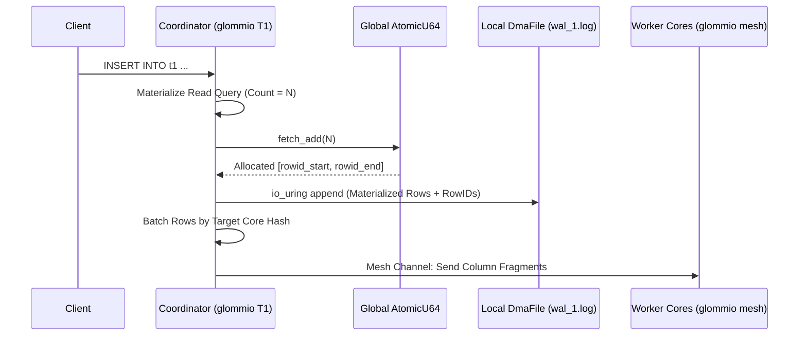
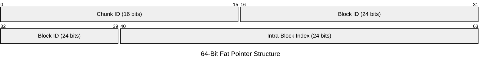
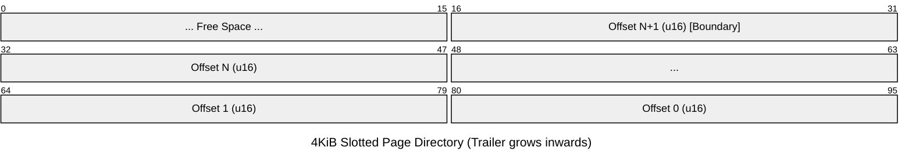
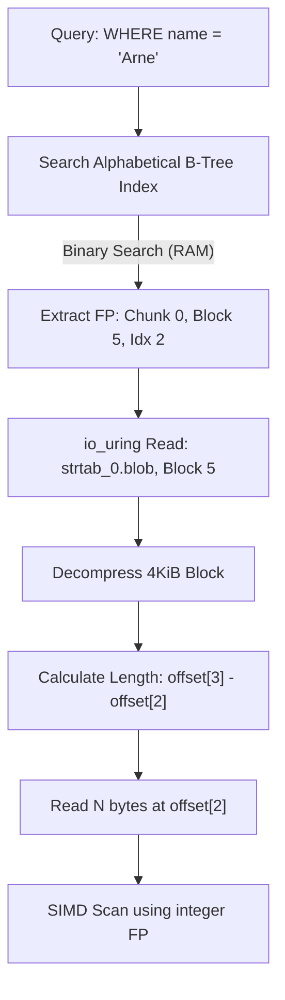

# Glommio-Optimized Database Architecture

## 1. Core Architecture (Glommio Runtime)
* **Design Paradigm:** Column-based, structured database accessed via a custom driver (no JDBC). 
* **Execution Model:** `glommio::LocalExecutor` bounds tasks to a single pinned CPU core. Data structures implement `!Send` and `!Sync`. Thread safety is enforced at compile time without atomic instructions.
* **Network Binding:** `glommio::net::TcpListener` uses `SO_REUSEPORT`. The Linux kernel distributes incoming TCP connections across pinned threads, bypassing user-space dispatchers.
* **Storage I/O:** Storage access strictly uses `glommio::io::DmaFile` (Direct I/O via `io_uring`). Bypassing the OS page cache allows the thread executor to process other tasks concurrently with disk operations.
* **Memory Alignment:** `DmaFile` requires strict hardware alignment. All in-memory 256KiB blocks are allocated with 4KiB page alignment. Compression is strictly disk-only; data is always uncompressed in memory to allow instant freeing without re-allocation penalties.

---

## 2. Storage Format & Topology
The directory structure logically separates data. Files are accessed exclusively by their mathematically assigned core. 

* **Logical Naming:** Column and table names are stored exclusively in `meta.json` files, not in the directory structure. Queries are compiled to use internal integer IDs, allowing zero-cost `$RENAME` operations without touching the filesystem or invalidating cached queries.
* **Sparse Blocks:** If a 256KiB block consists entirely of a single repeated value (common in boolean or tombstone columns), the physical `block_<n>.dat` file is omitted. The `meta_<n>.json` simply records a `sparse_value`, saving disk space and I/O.

### 2.1 Concrete Schema Layout Example: `users` Table
```text
.../database
└── users
    ├── meta.json
    ├── wal_0.log
    ├── wal_1.log
    └── table_0
        ├── meta.json
        ├── col_0 (tombstones)
        │   ├── meta.json (type: bool, compression: none)
        │   └── blocks
        │       ├── block_0.dat (up to 256KiB of 1-byte aligned bools)
        │       └── meta_0.json (first/last RID: 0/4)
        ├── col_1 (transaction)
        │   ├── meta.json (type: uint64, compression: none)
        │   └── blocks
        │       ├── block_0.dat (up to 32768 8-byte aligned uint64s)
        │       └── meta_0.json (first/last RID: 0/4)
        ├── col_2 (age)
        │   ├── meta.json (type: uint32, compression: none)
        │   └── blocks
        │       ├── block_0.dat (up to 65536 4-byte aligned uint32s)
        │       └── meta_0.json (first/last RID: 0/4, min: 21, max: 55)
        └── col_3 (name)
            ├── meta.json (type: string, compression: lz4)
            ├── strtab_0.blob (Zstd-compressed 4KiB blocks of raw string bytes)
            ├── strtab_0.idx (Alphabetical B-Tree: "Arne" -> [0 | 5 | 2])
            └── blocks
                ├── block_0.dat (64-bit Fat Pointers mapping to strtab_0.blob)
                └── meta_0.json (first/last RID: 0/4)
```

### 2.2 Data Ownership & Hashing
$$core\_id_{owner} \equiv hash(db\_id, table\_id, col\_id, block\_id) \pmod{num\_cores}$$

Hashing each column independently distributes a single row's columns across the mesh. This prevents the single core owning an active block from bottlenecking table writes.

---

## 3. Data Lifecycle: Transactions, Updates & Deletions
* **Deletions:** Data is never physically deleted inline. Every table contains an implicit `tombstones` column (boolean). Deleting a row simply flips its tombstone bit to `true`.
* **Updates:** Updates are strictly implemented as a `DELETE` followed by an `INSERT` at a new `rowid`.
* **Transactions:** Every table contains a `transaction` column (`uint64`). Every core maintains a local thread-safe ledger of ongoing transactions. When a transaction commits, its ID is removed from the ledger and the commit state is broadcasted to all cores via the mesh.
* **Implicit Filtering:** Because blocks are raw, compact, and aligned, the engine relies heavily on vectorized SIMD operations to aggressively apply an implicit `WHERE deleted = false AND committed = true` mask to every query before materializing results.

---

## 4. Inter-Core Mesh & Global State
* **SPSC Interconnect:** `glommio::channels::mesh` provides the $N \times N$ communication grid. Cores poll these queues asynchronously. Because data is `!Send`, cores cannot pass `Arc<Data>` pointers. Instead, the owner core fulfills read requests by sending dense, copied byte buffers over the mesh to the requesting core.
* **Global ID Allocation:** A single global `AtomicU64` manages `rowid` assignment. Locking once per batch transaction, rather than per row, minimizes atomic cache-line invalidation.

---

## 5. Write Pipeline (Insertions & WAL)
The coordinator core handles the transaction lifecycle within its local executor.

1. **Materialize & Allocate:** The coordinator buffers the insert payload, counts rows ($n$), and executes `fetch_add(n)` on the global atomic for a contiguous `rowid` block.
2. **Direct WAL Append:** The coordinator maps rows to `rowid`s and writes the batch to `wal_<core_id>.log` via `DmaFile` append.
3. **Mesh Dispatch:** The coordinator hashes the target core for each column fragment and sends batched SPSC messages.
4. **Local Materialization:** Target cores receive SPSC messages, update their `!Send` in-memory 256KiB buffers, and independently flush to disk. Target cores must then broadcast the updated block data back to any cores currently caching it.



---

## 6. Read Pipeline & Routing
Routing queries efficiently relies on thread-local metadata to minimize cross-core communication and disk I/O.

### 6.1 Zone Maps & Local Pruning
**What they are:** Zone maps are lightweight, block-level min/max indexes that allow the database to mathematically prove a block does not contain relevant data, enabling it to skip processing that block entirely.

**Storage on Disk:** When a worker core finishes writing and seals a 256KiB `block_<n>.dat`, it computes the minimum and maximum values for that specific chunk. It persists these bounds permanently in the block's adjacent `meta_<n>.json` file.

**In-Memory Routing:** On startup, the coordinator loads the contents of all `meta_<n>.json` files into a thread-local, in-memory map. When a query arrives (e.g., `WHERE age > 50`), the coordinator evaluates the predicate against this RAM-based map. If a block's `max` age is `45`, the coordinator instantly prunes that block from the execution plan, completely avoiding the mesh RPC and disk read. Active (unsealed) blocks are unconditionally included.

### 6.2 Mesh RPC & Zero-Copy Fetch
For blocks that survive pruning, batched read requests traverse the mesh to the target worker cores. Workers fetch the blocks via `DmaFile`, apply SIMD masks for `tombstones` and `transaction_committed`, and return dense buffers back across the mesh.

### 6.3 Tuple Alignment
The coordinator receives the scattered, filtered column fragments. It aligns them by `rowid` and streams the reconstructed tuples directly to the TCP socket.

---

## 7. String Dictionary (strtab) Implementation
The string table architecture decouples physical chronological storage from logical alphabetical sorting, enabling both block-level compression and $O(\log n)$ lookups.

* **Physical Storage (`strtab_N.blob`):** Strings are append-only. They are buffered into 4KiB blocks, compressed as an entire block (e.g., using Zstd or LZ4), and appended chronologically. 
* **The Fat Pointer:** The 64-bit integer stored in the 256KiB column blocks is a direct physical coordinate. This guarantees $O(1)$ physical resolution for reading data back.



* **The Alphabetical Index (`strtab_N.idx`):** A supplementary on-disk B-Tree maps `String -> Fat Pointer`. When loaded into memory, this index retains the string keys alongside physical offsets. This permits binary searches in RAM without triggering decompressions of the `.blob` blocks.
* **Arbitrary Wildcards (`%r%`):** Leading wildcards invalidate the alphabetical index. Users must explicitly define a secondary Trigram/N-gram index on specific columns to support fast arbitrary substring matching.

### 7.1 Block Compression & Alignment
Because compressed sizes are unpredictable, strings are accumulated in an uncompressed thread-local buffer until a conservative threshold is reached (e.g., 8KiB to 10KiB).

**Speculative De-escalation:** The engine attempts to compress this buffer. If the resulting output exceeds 4096 bytes, the last string is popped off, deferred to the next block's queue, and the buffer is re-compressed.

**Zero-Padding:** If the compressed output is smaller than 4096 bytes (e.g., 3800 bytes), the remainder is padded with zeros. This sacrifices a negligible amount of disk space to guarantee perfect `O_DIRECT` hardware alignment and strict $O(1)$ Fat Pointer math.

### 7.2 Intra-Block Resolution & Length Calculation
Decompressed 4KiB blocks function as slotted pages. A directory at the end of the block contains an array of `u16` byte offsets mapping the `Intra-Block Index` directly to physical start positions within the buffer.



To guarantee branchless $O(1)$ length calculation, a block containing $N$ strings strictly stores $N + 1$ offsets. This final $N+1$ offset is a synthetic boundary marker that contains no data. It points to the exact end of the data segment (the start of the free space), ensuring the `offset[i+1] - offset[i]` math works universally without requiring an `if (is_last_string)` branch instruction on the CPU hot path.



---

## 8. Distributed Sorting & Local Indexing

### 8.1 Distributed Tournament Sort (ORDER BY)
When a query requests an `ORDER BY`, every worker core first sorts its local column fragments in-memory. The cores then form a reduction tree, streaming their sorted buffers to designated peers via SPSC channels (e.g., Core 1 merges with Core 2). This halves the data hierarchically until a single sorted stream reaches the coordinator.

### 8.2 Strictly Thread-Local Indices
Every worker core maintains its own isolated `!Send` B-Tree or Hash Index that maps logical values strictly to the physical rows it personally owns. Because no other thread can read or write to this index, it requires zero atomics or mutexes. 

### 8.3 Distributed Index Resolution
The coordinator broadcasts an index query (e.g., `WHERE age = 30`) across the mesh. Each worker independently traverses its local index in parallel. Cores without matching records instantly drop the request, while cores owning the relevant data resolve the physical pointer and return the materialized tuple to the coordinator.
