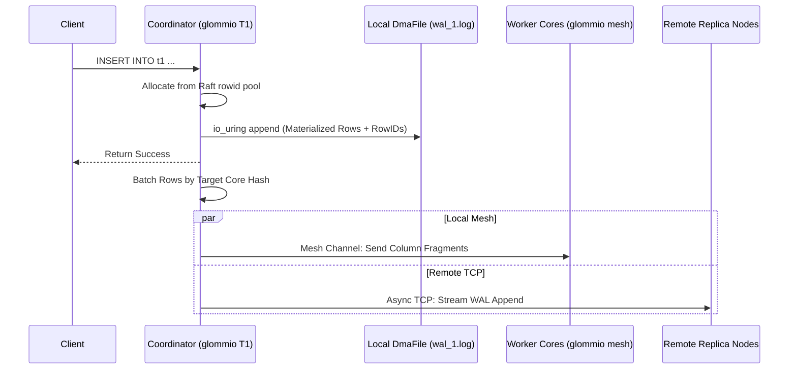
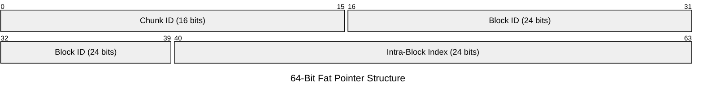
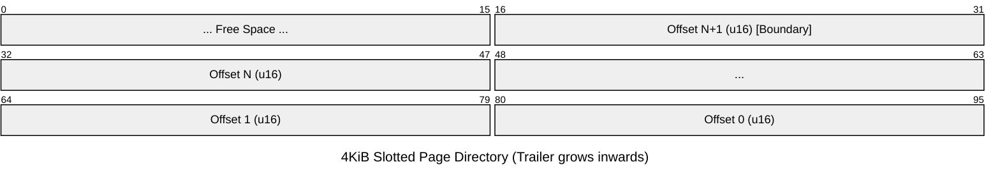
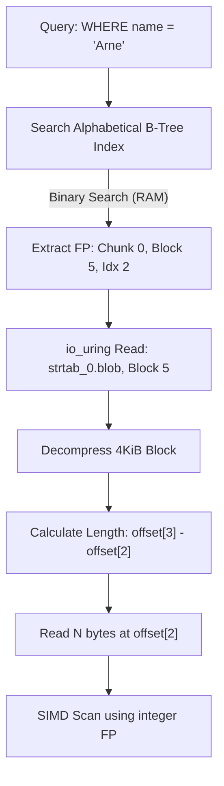

# Glommio-Optimized Distributed Database Architecture

## 1. Core Architecture (Glommio Runtime)
* **Execution Model:** `glommio::LocalExecutor` bounds tasks to a single pinned CPU core. Data structures implement `!Send` and `!Sync`. Thread safety is enforced at compile time without atomic instructions.
* **Network Binding:** `glommio::net::TcpListener` uses `SO_REUSEPORT`. The Linux kernel distributes incoming TCP connections across pinned threads, bypassing user-space dispatchers.
* **Storage I/O:** Storage access strictly uses `glommio::io::DmaFile` (Direct I/O via `io_uring`). Bypassing the OS page cache allows the thread executor to process other tasks concurrently with disk operations.
* **Memory Alignment:** `DmaFile` requires strict hardware alignment. All in-memory 256KiB blocks are allocated with 4KiB page alignment. Compression is strictly disk-only.

---

## 2. Distributed Topology & Replication
* **Active-Active Multi-Master:** The cluster uses a decentralized, multi-master topology. Every physical node holds a full replica of the dataset. Queries execute 100% locally to guarantee deterministic memory and `io_uring` speeds without network scatter-gather latency.
* **Control Plane (Raft):** A lightweight Raft consensus group exists strictly to allocate massive, isolated blocks of `rowid`s and Hybrid Logical Clock (HLC) epochs to individual nodes (e.g., Node A owns `[0, 256k)`). Raft is never on the hot data path.
* **Asynchronous Replication:** Upon a local insert, the coordinator commits the `DmaFile` WAL append locally at bare-metal speed. The serialized WAL stream is asynchronously pushed over TCP to remote peers, providing eventual consistency across geographic zones without blocking client responses.

---

## 3. Storage Format & Hashing
* **Logical Naming:** Column and table names are stored exclusively in `meta.json` files. Queries are compiled to use internal integer IDs, allowing zero-cost `$RENAME` operations without touching the filesystem.
* **Sparse Blocks:** If a 256KiB block consists entirely of a single repeated value, the physical `block_<n>.dat` file is omitted. The `meta_<n>.json` simply records a `sparse_value`.

### 3.1 Data Ownership
$$core\_id_{owner} \equiv hash(db\_id, table\_id, col\_id, block\_id) \pmod{num\_cores}$$

Hashing each column independently distributes a single row's columns across the mesh. Incoming replication streams from remote peers route column fragments to the exact same relative pinned cores across the entire cluster deterministically.

### 3.2 Concrete Schema Layout Example: `users` Table
```text
.../database
└── users
    ├── meta.json
    ├── wal_0.log
    ├── wal_1.log
    └── table_0
        ├── meta.json
        ├── col_0 (tombstones)
        │   ├── meta.json (type: bool, compression: none)
        │   └── blocks
        │       ├── block_0.dat (up to 256KiB of 1-byte aligned bools)
        │       └── meta_0.json (first/last RID: 0/4)
        ├── col_1 (transaction_hlc)
        │   ├── meta.json (type: uint64, compression: none)
        │   └── blocks
        │       ├── block_0.dat (up to 32768 8-byte aligned uint64s)
        │       └── meta_0.json (first/last RID: 0/4)
        ├── col_2 (age)
        │   ├── meta.json (type: uint32, compression: none)
        │   └── blocks
        │       ├── block_0.dat (up to 65536 4-byte aligned uint32s)
        │       └── meta_0.json (first/last RID: 0/4, min: 21, max: 55)
        └── col_3 (name)
            ├── meta.json (type: string, compression: lz4)
            ├── strtab_0.blob (Zstd-compressed 4KiB blocks of raw string bytes)
            ├── strtab_0.idx (Alphabetical B-Tree: "Arne" -> [0 | 5 | 2])
            └── blocks
                ├── block_0.dat (64-bit Fat Pointers mapping to strtab_0.blob)
                └── meta_0.json (first/last RID: 0/4)
```

---

## 4. Data Lifecycle & Conflict Resolution
* **Hybrid Logical Clocks (HLC):** Each node generates a 64-bit HLC: `[Physical Timestamp | Local Counter | Node ID]`. This ensures globally unique, chronologically ordered sequence numbers with zero network coordination.
* **Last-Write-Wins (LWW):** The `transaction` column persists the HLC for every row. When a replicated WAL stream arrives, the worker core uses SIMD to compare the incoming HLC against the local `transaction` column. The highest integer wins, with the hardware `Node ID` acting as a deterministic tie-breaker.
* **Deletions:** Data is never physically deleted inline. Every table contains an implicit `tombstones` column (boolean). Deleting a row simply flips its tombstone bit to `true`. Tombstones follow the exact same LWW logic as standard data writes.
* **Updates:** Updates are strictly implemented as a `DELETE` followed by an `INSERT` at a new `rowid`.
* **Implicit Filtering:** The engine relies heavily on vectorized SIMD operations to aggressively apply an implicit `WHERE deleted = false AND committed = true` mask to every query before materializing results.

---

## 5. Write Pipeline (Local + Replicated)
1. **Materialize & Allocate:** The coordinator buffers the insert payload, counts rows (n), and allocates a contiguous `rowid` block from its pre-approved Raft pool.
2. **Local Commit:** The coordinator maps rows to `rowid`s, writes the batch to `wal_<core_id>.log` via `DmaFile` append, and instantly returns success to the client.
3. **Dual Dispatch:** Concurrently, the coordinator streams the WAL entry over TCP to remote replica nodes, and dispatches the column fragments over the local `glommio::channels::mesh` to target worker cores.
4. **Local Materialization:** Target cores receive SPSC messages, update their `!Send` in-memory 256KiB buffers, and independently flush to disk.



---

## 6. Read Pipeline & Routing
### 6.1 Zone Maps & Local Pruning
Zone maps are lightweight, block-level min/max indexes persisted in `meta_<n>.json` files. On startup, the coordinator loads these bounds into a thread-local map. Queries are evaluated against this RAM-based map to instantly prune blocks from the execution plan without triggering mesh RPCs or disk reads.

### 6.2 Mesh RPC & Zero-Copy Fetch
For surviving blocks, batched read requests traverse the mesh to target workers. Workers fetch the blocks via `DmaFile`, apply SIMD masks for `tombstones` and `transaction_committed`, and return dense buffers back across the mesh.

### 6.3 Tuple Alignment
The coordinator receives the scattered, filtered column fragments. It aligns them by `rowid` and streams the reconstructed tuples directly to the TCP socket.

---

## 7. String Dictionary (strtab) Implementation
The string table architecture decouples physical chronological storage from logical alphabetical sorting, enabling block-level compression and $O(\log n)$ lookups.

* **Physical Storage (`strtab_N.blob`):** Strings are append-only. They are buffered into 4KiB blocks, compressed, and appended chronologically. 
* **The Fat Pointer:** The 64-bit integer stored in the 256KiB column blocks is a direct physical coordinate guaranteeing $O(1)$ physical resolution.

* **The Alphabetical Index (`strtab_N.idx`):** A supplementary on-disk B-Tree maps `String -> Fat Pointer`. When loaded into memory, this index permits binary searches in RAM without triggering decompressions of the `.blob` blocks.
* **Arbitrary Wildcards (`%r%`):** Leading wildcards invalidate the alphabetical index. Users must explicitly define a secondary Trigram/N-gram index on specific columns to support fast arbitrary substring matching.

### 7.1 Block Compression & Alignment
Strings accumulate in an uncompressed thread-local buffer until a conservative threshold is reached (e.g., 8KiB to 10KiB). 

* **Speculative De-escalation:** The engine attempts to compress this buffer. If the resulting output exceeds 4096 bytes, the last string is popped off, deferred to the next block's queue, and the buffer is re-compressed.
* **Zero-Padding:** If the compressed output is smaller than 4096 bytes, the remainder is padded with zeros to guarantee perfect `O_DIRECT` hardware alignment.

### 7.2 Intra-Block Resolution & Length Calculation
Decompressed 4KiB blocks function as slotted pages. A directory at the end of the block contains an array of `u16` byte offsets mapping the `Intra-Block Index` directly to physical start positions.



To guarantee branchless $O(1)$ length calculation, a block containing N strings strictly stores N+1 offsets. The final N+1 offset points to the exact end of the data segment, ensuring `offset[i+1] - offset[i]` works universally without branch instructions.



---

## 8. Background Compaction & Garbage Collection
* **Cooperative Scheduling:** A dedicated compaction `glommio::Task` runs continuously on each core's executor, yielding at `.await` points to avoid stalling the hot network paths.
* **Zero-Coordination:** Because cores strictly own their physical files, the compaction task reads, rewrites, and deletes files independently without cross-core locks or atomics.
* **The Rewrite Pipeline:** The task scans sealed blocks, applies SIMD masks to drop tombstones, writes surviving data into a dense new 256KiB block, computes new zone map bounds, and atomically swaps the files via filesystem `rename`.
* **String Table GC:** Surviving strings from highly fragmented `strtab_N.blob` chunks are appended chronologically into a fresh chunk. The core immediately updates the alphabetical B-Tree index with the new Fat Pointers and unlinks the orphaned blob files.

---

## 9. Distributed Sorting & Local Indexing
* **Distributed Tournament Sort:** When a query requests an `ORDER BY`, every worker core sorts its local fragments in-memory. Cores form a reduction tree, streaming their sorted buffers to designated peers via SPSC channels hierarchically until a single sorted stream reaches the coordinator.
* **Strictly Thread-Local Indices:** Every worker core maintains its own isolated `!Send` B-Tree or Hash Index that maps logical values strictly to the physical rows it owns.
* **Distributed Index Resolution:** The coordinator broadcasts an index query across the mesh. Workers independently traverse their local indices in parallel. Cores without matching records drop the request; owners resolve the physical pointer and return the materialized tuple.
